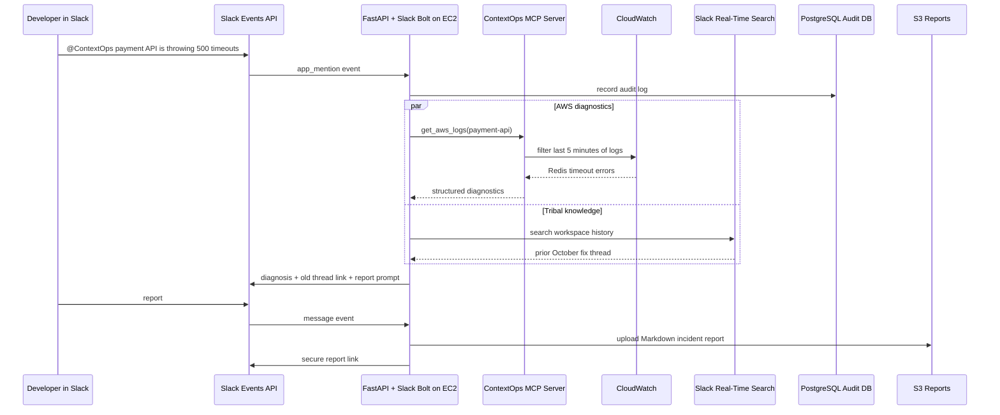
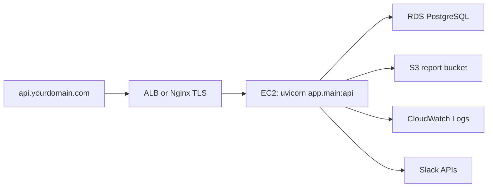

# ContextOps Architecture

## Product Flow



## Runtime Components

### Slack Agent

The Slack agent is built with Slack Bolt for Python and mounted inside FastAPI at
`/slack/events`. Bolt validates Slack signatures, routes `app_mention` events,
and posts threaded replies.

### MCP Diagnostics Server

The MCP server exposes controlled AWS tools:

- `get_aws_logs`
- `check_server_status`

The Slack agent can call the diagnostic layer directly in development or through
MCP stdio transport in production-like demos. This keeps AWS access behind a
small, auditable tool boundary.

### AWS Integrations

CloudWatch provides live failure signals. S3 stores generated incident reports.
RDS PostgreSQL stores audit logs showing who asked ContextOps to inspect which
system and when.

### Slack Search

The knowledge search module calls Slack Web API search using the configured
`SLACK_REALTIME_SEARCH_METHOD`. It converts matches into a consistent incident
memory shape with title, channel, author, permalink, and snippet.

## Security Notes

- Slack signing secrets are verified by Bolt.
- AWS credentials should come from the EC2 instance role.
- S3 reports use server-side encryption and pre-signed links.
- RDS audit logs record every investigation and report generation request.
- MCP tools intentionally expose narrow diagnostic actions rather than general
  AWS SDK access.

## Deployment



Recommended EC2 process command:

```bash
uvicorn app.main:api --host 0.0.0.0 --port 8000
```

Slack request URL:

```text
https://api.yourdomain.com/slack/events
```
